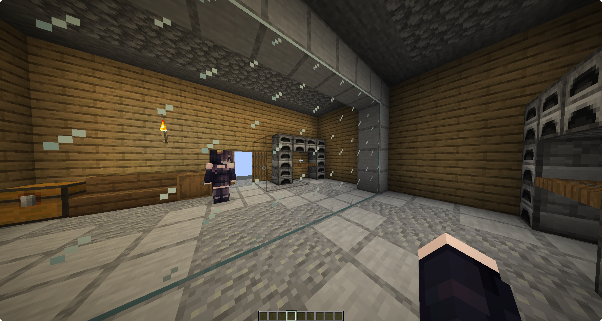

# Mirrora [[简体中文]](README.md)

Create realistic mirrors in Minecraft servers. Players standing in front
of the mirror can see their own real-time reflection (as well as all
other nearby players), including poses, equipment, facing direction, and
hand animations.

<p align="center">
  
</p>

<p align="center">
  
</p>

## Features

- The mirror exists as a fixed rectangular area in the world, attached to a wall, and remains after server restarts.
- Only players standing on the **front side** of the mirror and within the selected rectangular area and effective depth range will be reflected.
- All players inside the mirror area can see each other's reflections.
- Reflections synchronize position, direction, pose, equipment, hand animations, and actions.
- The mirror is only visible to players inside the area.
- (Optional) The mirror can also reflect blocks on the player's side, including directional blocks such as stairs, chests, and signs, so it looks like seeing what's behind you in a real mirror.

## How It Works

The plugin uses the `mannequin` entity introduced in Minecraft 1.21.9+
as the reflection carrier.

Using [packetevents](https://github.com/retrooper/packetevents), entity
packets are directly sent to clients. No real entities are created on
the server, and no resource packs or client mods are required.

Block reflection works similarly: the plugin periodically scans the block
region in front of the mirror (the same rectangle/depth as the mirror itself,
on the player's side), mirrors each block's position and facing using the
same reflection rule, and fakes it to observers inside the mirror area via
`BlockChange` packets. Block changes are synced at a lower polling rate, and
observers who leave the area immediately see the real block state restored.
No block is actually changed server-side — this is purely a client-side
visual illusion.

## Block Reflection (optional feature)

When enabled, the mirror also reflects blocks on the player's side — using
the same rectangle and depth as the mirror itself — so it looks like seeing
the furniture or walls behind you in a real mirror:

- Directional blocks (stairs, chests, furnaces, doors, signs, mob heads, etc.) have their facing automatically flipped when mirrored.
- Block reflection refreshes at its own, independent (and by default much lower) rate than player reflection, since blocks change far less often than player actions.
- The detection rectangle can be expanded outward on the width/height axes (depth is unaffected), so it can cover a larger area than the mirror itself.
- For performance, each mirror has a cap on the total number of blocks it may reflect; mirrors exceeding the cap skip block reflection (player reflection is unaffected).
- This feature is disabled by default and must be turned on in the config file.

## Configuration

```yaml
# Language
language: en_us

mirror:
  # Default mirror depth (in blocks) when no depth is specified during creation
  default-depth: 8.0

  # Maximum allowed mirror depth (in blocks)
  max-depth: 32.0

  # Reflection update interval (in ticks). Lower values provide smoother reflections but increase performance cost.
  tick-interval: 1

  block-reflection:
    # Whether to reflect blocks in front of the mirror (same rectangle/depth as the mirror itself)
    enabled: false

    # Block reflection refresh interval (in ticks). Should be much larger than mirror.tick-interval since blocks change less often.
    tick-interval: 20

    # Maximum number of blocks a single mirror is allowed to reflect. Mirrors exceeding this are skipped for block reflection.
    max-blocks: 4096

    # Number of blocks to expand the detection rectangle outward on the width/height axes (depth is unaffected)
    expand: 0

wand:
  # Material used for the region selection wand
  material: BLAZE_ROD
```

## Dependencies

- [Paper](https://papermc.io/) 1.21.9 or higher
- [packetevents](https://github.com/retrooper/packetevents) 2.13.0 or higher

## Installation

1. Install packetevents into the `plugins/` directory.
2. Put `Mirrora.jar` into the `plugins/` directory.
3. Start the server.

## Usage

Creating mirrors requires `mirrora.admin` permission.

### 1. Get Selection Tool

```
/mirror wand
```

Obtain a "mirror selection tool" to select a wall area as the mirror range.

### 2. Select Two Points

Hold the selection tool:

- **Left click** a block on the wall as point 1
- **Right click** another block on the wall as point 2

The two points must be on walls with the **same facing direction** (for example, both on a north-facing wall), otherwise the mirror cannot be created.

The rectangle formed between the two points becomes the mirror area.

### 3. Create Mirror

```
/mirror create <id> [depth]
```

- `id`: Unique identifier of the mirror, used for later management (removing, listing)
- `depth` (optional): Effective distance in front of the mirror, measured in blocks. Default: 8, maximum: 32. Players must stand within this distance to see or be reflected.

Example:

```
/mirror create test-mirror 6
```

### 4. Manage Mirrors

```
/mirror list # List all created mirrors
/mirror remove <id> # Remove a specific mirror
```

## Commands & Permissions

| Command | Description | Permission |
| --- | --- | --- |
| `/mirror wand` | Get selection tool | `mirrora.admin` |
| `/mirror create <id> [depth]` | Create mirror | `mirrora.admin` |
| `/mirror remove <id>` | Remove mirror | `mirrora.admin` |
| `/mirror list` | List mirrors | `mirrora.admin` |
| `/mirror reload` | Reload the configuration file | `mirrora.admin` |

| Permission Node | Description | Default |
| --- | --- | --- |
| `mirrora.admin` | Allows creating, removing, and managing mirror areas | `op` |

After a mirror is created, any player standing inside the mirror area can see reflections without additional permissions.

## Data Storage

Mirror area information is stored in: `plugins/Mirrora/mirrors.yml`  
The plugin automatically loads mirror data on startup and immediately writes changes to disk when mirrors are created or removed.
